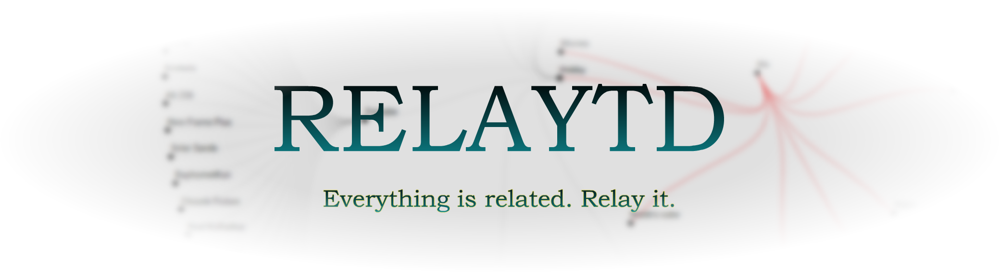

Software Engineer - Creative Coder (Graphics) - [2D Animator Hobbyist](https://www.instagram.com/stkykenny/)
 <i>and whatever else gets the job done</i>

_\~Comment your code properly, because you won't remember what you did.~_  
_\~I solve problems - I'm not a human database~_   

## Working on  

This is a [**Multi-Tool Productivity and Digital Archive App**](https://stickykenny.github.io/Overlaytd/tree)  

[Ecosystem's Backlog](https://github.com/users/Stickykenny/projects/2)

|  Component | Main Stack |   Description|
|---|---|---|
|  <a href="https://github.com/Stickykenny/Relaytd">Relayd</a> |  Java-Spring  | Back-End and database management logics |
|  <a href="https://github.com/Stickykenny/Overlaytd">Overlaytd </a> | Angular | Front-End, and visualization with p5 or d3  |
|  <a href="https://github.com/Stickykenny/Playground/tree/main/discord-tasklist-bot"> Tasklist-Discord-Bot </a>| Python  |  Sync-on-Demand tasklist : Using Discord as an intermediary to transmit instruction from mobile to desktop app |
|   Unnamed |    |  Integrating RSS |

 

## Preferred stack Web Apps - Data - Graphics

<a title="Java"> 

✦

✦

✦

✦

✦

✦

## Main Software used 

<!--
**Stickykenny/Stickykenny** is a ✨ _special_ ✨ repository because its `README.md` (this file) appears on your GitHub profile.

Here are some ideas to get you started:

- 🔭 I’m currently working on ...
- 🌱 I’m currently learning ...
- 👯 I’m looking to collaborate on ...
- 🤔 I’m looking for help with ...
- 💬 Ask me about ...
- 📫 How to reach me: ...
- ⚡ Fun fact: ...
-->
